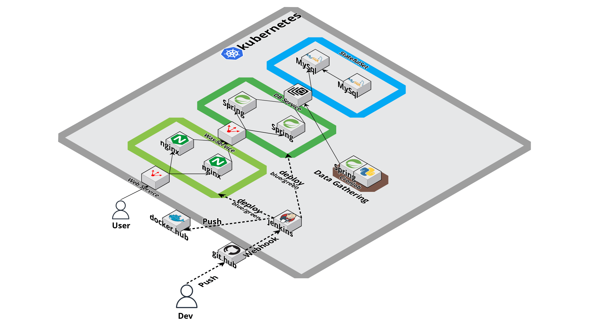

<h1 align="center">원자재 수집 및 예측 프로젝트 아키텍쳐 💻 </h1>

## 🛠️ 기술 스택

 
 


## 🤹🏻 기술 스택 선정 이유

- Git hub : git hub의 git hook을 통해 Jenkins에 작업을 지시하기 위해서 사용하였습니다
- Jenkins : Doker 이미지를 Doker hub에 Push 후 kubernetes에 작업을 지시하는 것을 자동화 하기 위해서 사용하였습니다
- kubernetes : 프라이빗 클라우드 환경을 만들기 위해서 사용하였습니다

## 📌 프로젝트 목표

```sh
1. git, jenkins를 사용하여 kubernetes에 자동화 배포를 구현하기 입니다
2. kubernetes를 사용하 프라이빗 클라우드 환경 구현하기 입니다
```

## 📄 아키텍쳐 구조도

<center>
    
</center>

## 🔍 Overview

### 1. git hook을 사용한 자동화 배포

\*작업 순서

1. git hub에 개발한 내용을 dockerfile과 함께 repository push한다
2. jenkin에서 repository의 파일을 받아온다
3. dockerfile로 doker 이미지를 만들어 doker hub에 push 한다
4. kubernetes에 작업을 지시를 한다
   4-1. blue/green 형식으로 배포횟수가 짝수, 홀수인지 확인 후 blue/green 갯수를 조절한다
   예를 들어 짝수일 경우 blue RelicaSet의 최신 버전의 pod를 생성하고 이전 버전인 green RelicaSet의 pod의 수를 0으로 만들어 준다
   <br>

### 2. kubernetes을 사용한 프라이빗 클라우드 만들기

- WEB, WAS, DB를 3계층 아키텍쳐를 만든다
- WEB, WAS는 각각2개씩 만들어 LB Service에 연결하여 부하 분산 처리를 한다
- DB는 2중화 하여 저장 안정성을 높인다 - master, slave 설정 파일을 volum 설정한다 - 데이터를 저장할 수 있도록 master, slave를 node의 volum 각각 지정한다
  <br>
